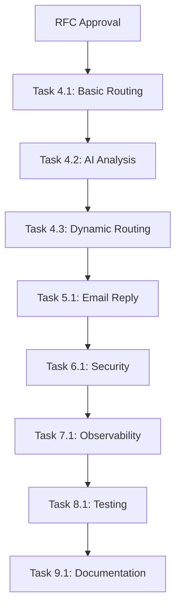
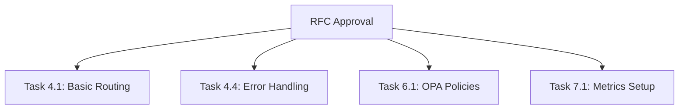

# ALC-RFC-006 Cross-Team Dependencies
## tgk Phase 6: Email Orchestration Collaboration Matrix

### 📊 **Team Overview & Responsibilities**

| Team | Lead | Primary Responsibility | Secondary Support |
|------|------|----------------------|-------------------|
| **Alchemists Council** | @brendadeeznuts1111 | Strategic oversight, RFC approval, budget allocation | Final escalation point |
| **Infra Team** | @alice.smith | Cloudflare Workers, D1/R2, deployment, observability | Email routing infrastructure |
| **Integrations Hub** | @charlie.brown | API integrations, external services, bidirectional flow | Email-Telegram bridge |
| **Quality Gate** | @diana.prince | AI implementation, testing, security policies | Content analysis & validation |
| **Knowledge Base** | @frank.taylor | Documentation, training, runbooks | User adoption & support |

---

## 🔗 **Dependency Matrix**

### **Critical Path Dependencies**

### **Parallel Dependencies**

---

## 🤝 **Team Collaboration Details**

### **1. Infra Team ↔ Integrations Hub**
**Primary Interface:** Email Worker ↔ tgk APIs

#### **Handover Points**
- **Week 2:** Infra delivers basic Worker with email parsing → Integrations enhances with dynamic routing
- **Week 4:** Infra provides R2/D1 storage → Integrations implements caching for email context
- **Week 6:** Infra sets up monitoring → Integrations adds business metrics

#### **Shared Responsibilities**
- API contract definition for `route.resolveTelegramChatID`
- Environment variable management across staging/production
- Incident response coordination for email routing failures

#### **Communication Cadence**
- Daily standup during integration phases
- Weekly dependency review meetings
- Shared Slack channel: `#tgk-email-integration`

---

### **2. Quality Gate ↔ Infra Team**
**Primary Interface:** AI Module ↔ Worker Integration

#### **Handover Points**
- **Week 1:** Quality Gate provides AI analysis API spec → Infra implements Worker calls
- **Week 3:** Quality Gate delivers trained models → Infra deploys to staging
- **Week 8:** Quality Gate completes security testing → Infra prepares production deployment

#### **Shared Responsibilities**
- AI performance monitoring and alerting thresholds
- PII detection policy enforcement
- AI model updates and rollback procedures

#### **Communication Cadence**
- Bi-weekly AI performance reviews
- Immediate alerts for AI accuracy degradation
- Shared dashboards for AI metrics

---

### **3. Integrations Hub ↔ Quality Gate**
**Primary Interface:** External APIs ↔ AI Validation

#### **Handover Points**
- **Week 2:** Integrations provides external API specs → Quality Gate creates validation policies
- **Week 4:** Integrations implements bidirectional flow → Quality Gate adds security validation
- **Week 6:** Integrations delivers interactive buttons → Quality Gate tests user experience

#### **Shared Responsibilities**
- External API failure handling and fallback strategies
- User permission validation across Telegram ↔ Email
- Data consistency between internal cache and external systems

#### **Communication Cadence**
- Weekly API integration reviews
- Daily during critical integration phases
- Shared testing environment coordination

---

### **4. Knowledge Base ↔ All Teams**
**Primary Interface:** Documentation as Code

#### **Handover Points**
- **Ongoing:** All teams provide implementation details → Knowledge Base creates documentation
- **Week 9:** Quality Gate delivers test results → Knowledge Base creates troubleshooting guides
- **Week 11:** All teams provide runbooks → Knowledge Base publishes complete documentation

#### **Shared Responsibilities**
- Living documentation maintenance
- Training material development
- User feedback collection and documentation updates

#### **Communication Cadence**
- Weekly documentation review meetings
- PR reviews for documentation changes
- User feedback integration sessions

---

## ⚡ **Critical Integration Points**

### **Week 2: Foundation Integration**
**Focus:** Basic routing + AI analysis
**Risk:** AI latency affecting email delivery
**Mitigation:** Async processing, caching, circuit breakers

### **Week 4: Dynamic Routing**
**Focus:** On-call integration + interactive messages
**Risk:** External API failures causing routing errors
**Mitigation:** Fallback routing, comprehensive logging

### **Week 6: Bidirectional Flow**
**Focus:** Email replies from Telegram
**Risk:** Authentication and permission issues
**Mitigation:** RBAC policies, audit trails, gradual rollout

### **Week 8: Production Readiness**
**Focus:** Security + observability + testing
**Risk:** Security vulnerabilities or performance issues
**Mitigation:** Security reviews, load testing, phased deployment

---

## 🚨 **Escalation Paths**

### **Technical Escalations**
1. **Individual Team Lead** (immediate response)
2. **Cross-Team Technical Review** (within 4 hours)
3. **Alchemists Council** (within 24 hours for blocking issues)
4. **Executive Escalation** (business-critical issues)

### **Timeline Escalations**
1. **Team Lead** identifies delay risk
2. **Project Manager** assesses impact
3. **Cross-Team Review** to identify mitigation options
4. **RFC Change Control** for scope adjustments

### **Quality Escalations**
1. **Quality Gate Lead** identifies issue
2. **Affected Team** implements fix
3. **Cross-Team Review** validates resolution
4. **Regression Testing** before proceeding

---

## 📋 **Weekly Checkpoints**

### **Monday: Planning & Dependencies**
- Review progress against implementation plan
- Identify upcoming dependencies and handovers
- Update risk register
- Plan work for the week

### **Wednesday: Mid-Week Review**
- Cross-team dependency status
- Blocker identification and resolution
- Progress against weekly objectives
- Adjust plans as needed

### **Friday: Week Close**
- Document lessons learned
- Update implementation plan with actuals
- Prepare for next week's dependencies
- Communicate status to stakeholders

---

## 🔄 **Dependency Management Process**

### **Dependency Identification**
1. Task owner identifies external dependencies
2. Dependency documented in implementation plan
3. Dependent team notified with timeline and requirements
4. Dependency added to weekly checkpoint agenda

### **Dependency Tracking**
1. Status updated in shared tracking document
2. Color-coded status: 🟢 Ready, 🟡 At Risk, 🔴 Blocked
3. Automated alerts for overdue dependencies
4. Weekly review of all active dependencies

### **Dependency Resolution**
1. Early identification of potential issues
2. Collaborative problem-solving approach
3. Escalation when needed
4. Lesson learned documentation for future projects

---

## 📞 **Communication Channels**

### **Primary Channels**
- **Slack:** `#tgk-phase6` for daily communication
- **GitHub:** Issues and PRs for formal requirements
- **Weekly Meetings:** Cross-team sync calls
- **Email:** Formal notifications and escalations

### **Emergency Communication**
- **Phone:** For production incidents
- **Slack Emergency Channel:** `#tgk-emergency`
- **On-Call Rotation:** 24/7 coverage during deployment phases

### **Documentation**
- **Implementation Plan:** Living document in `.rfc/ALC-RFC-006/`
- **Decision Log:** All major decisions recorded
- **Risk Register:** Proactive risk management
- **Meeting Notes:** Shared in `#tgk-phase6` channel

---

## 🎯 **Success Metrics**

### **Team Collaboration**
- [ ] Zero missed dependency handovers
- [ ] < 24hr resolution for cross-team blockers
- [ ] 100% attendance at weekly checkpoints
- [ ] Positive feedback in post-project retrospectives

### **Project Delivery**
- [ ] All dependencies delivered on time
- [ ] No critical path delays
- [ ] Comprehensive documentation completed
- [ ] Successful production deployment

### **Quality Outcomes**
- [ ] All acceptance criteria met
- [ ] No post-deployment critical issues
- [ ] Positive user adoption metrics
- [ ] Security and compliance requirements satisfied
