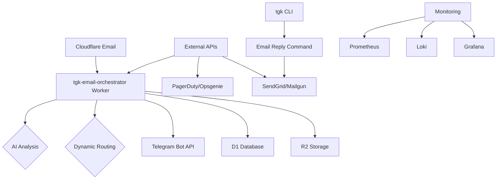

# ALC-RFC-006 Deployment Strategy
## tgk Phase 6: Safe Rollout & Rollback Procedures

### 🎯 **Overview**
This deployment strategy ensures safe, gradual rollout of the tgk Phase 6 email orchestration system with comprehensive rollback capabilities and minimal business risk.

---

## 🚀 **Deployment Architecture**

### **Production Environment Setup**



### **Staging Environment Setup**
- Complete mirror of production environment
- Separate Cloudflare account/zone
- Test email domain: `*.test.alchemy.run`
- Isolated monitoring and alerting

---

## 📦 **Phased Rollout Strategy**

### **Phase 1: Foundation (Week 1-2)**
**Scope:** Basic email routing without AI
**Risk Level:** Low
**Duration:** 2 weeks

#### **Deployment Steps**
1. **Day 1:** Deploy basic `tgk-email-orchestrator` Worker
   ```bash
   wrangler deploy --env staging
   # Routes: *@test.alchemy.run → Worker
   ```

2. **Day 3:** Enable routing for 10% of production traffic
   ```bash
   # Update Cloudflare Email Routing rule
   # Weight: 10% to new Worker, 90% to existing system
   ```

3. **Day 7:** Increase to 50% traffic split
4. **Day 10:** Full production deployment
5. **Day 14:** Remove old routing system

#### **Success Criteria**
- [ ] 99.9% email delivery rate maintained
- [ ] No routing errors in logs
- [ ] Basic functionality works for all teams
- [ ] Monitoring dashboards show expected metrics

#### **Rollback Triggers**
- Email delivery rate drops below 99.5%
- > 5 routing errors per hour
- Critical functionality broken

---

### **Phase 2: AI Enhancement (Week 3-4)**
**Scope:** Add AI content analysis
**Risk Level:** Medium
**Duration:** 2 weeks

#### **Deployment Steps**
1. **Week 3:** Deploy AI analysis to staging
   ```bash
   # Enable AI features in staging Worker
   wrangler secret put OPENAI_API_KEY --env staging
   wrangler deploy --env staging
   ```

2. **Week 3, Day 5:** AI analysis for 25% of emails in production
3. **Week 4:** Full AI deployment
4. **Week 4, Day 5:** AI accuracy monitoring begins

#### **Success Criteria**
- [ ] AI processing adds < 3 seconds to email delivery
- [ ] Sentiment analysis accuracy > 85%
- [ ] No PII leakage incidents
- [ ] AI failures don't break email delivery

#### **Rollback Triggers**
- AI processing causes > 10 second delays
- AI accuracy < 70%
- PII detection failures

---

### **Phase 3: Dynamic Routing (Week 5-7)**
**Scope:** On-call schedules, interactive messages
**Risk Level:** High
**Duration:** 3 weeks

#### **Deployment Steps**
1. **Week 5:** Deploy dynamic routing to staging with external API mocks
2. **Week 6:** Integrate real external APIs (PagerDuty, Opsgenie)
3. **Week 6, Day 5:** Dynamic routing for critical alerts only
4. **Week 7:** Full dynamic routing deployment
5. **Week 7, Day 5:** Interactive buttons enabled

#### **Success Criteria**
- [ ] On-call routing accuracy > 95%
- [ ] Interactive buttons work for all users
- [ ] External API failures handled gracefully
- [ ] No routing loops or infinite redirects

#### **Rollback Triggers**
- On-call routing accuracy < 80%
- Interactive buttons cause user confusion
- External API outages cause widespread failures

---

### **Phase 4: Bidirectional Flow (Week 8-9)**
**Scope:** Email replies from Telegram
**Risk Level:** Medium
**Duration:** 2 weeks

#### **Deployment Steps**
1. **Week 8:** Deploy email reply functionality to staging
2. **Week 8, Day 5:** Email replies enabled for pilot users
3. **Week 9:** Full bidirectional deployment
4. **Week 9, Day 5:** Reply threading validation

#### **Success Criteria**
- [ ] Email replies deliver successfully
- [ ] Reply threading works correctly
- [ ] No authentication bypasses
- [ ] Reply rate limits enforced

#### **Rollback Triggers**
- Email reply failures > 10%
- Authentication issues discovered
- Reply spam/abuse detected

---

### **Phase 5: Production Optimization (Week 10-11)**
**Scope:** Performance tuning, monitoring
**Risk Level:** Low
**Duration:** 2 weeks

#### **Deployment Steps**
1. **Week 10:** Performance optimizations
2. **Week 10, Day 5:** Enhanced monitoring deployed
3. **Week 11:** Final security hardening
4. **Week 11, Day 5:** Go-live readiness review

#### **Success Criteria**
- [ ] Performance meets all SLAs
- [ ] Monitoring covers all failure modes
- [ ] Security assessment passed
- [ ] Documentation complete

---

## 🔄 **Rollback Strategy**

### **Immediate Rollback (< 10 minutes)**

#### **Full System Rollback**
```bash
# 1. Disable email routing to new Worker
cfcli email routing disable tgk-email-orchestrator

# 2. Restore previous routing rule
cfcli email routing enable legacy-email-router

# 3. Delete new Worker (keeps code for analysis)
wrangler delete tgk-email-orchestrator --keep-code

# 4. Update tgk CLI to previous version
npm install tgk@5.0.0

# Verification: Email delivery restored within 5 minutes
```

#### **Feature-Specific Rollback**
```bash
# Disable AI analysis
wrangler secret delete OPENAI_API_KEY

# Disable dynamic routing
wrangler env set DYNAMIC_ROUTING=false

# Disable bidirectional replies
wrangler env set EMAIL_REPLIES=false
```

### **Gradual Rollback (1-4 hours)**

#### **Traffic Shifting**
```bash
# Gradually reduce traffic to new system
cfcli email routing weight tgk-email-orchestrator 75
cfcli email routing weight tgk-email-orchestrator 50
cfcli email routing weight tgk-email-orchestrator 25
cfcli email routing weight tgk-email-orchestrator 0

# Then complete full rollback
```

#### **Data Migration Rollback**
```bash
# Export current D1 data
wrangler d1 export tgk_email_metadata backup.sql

# Restore previous state (if applicable)
# Note: Email orchestration is stateless, so minimal data rollback needed
```

### **Extended Rollback (1-24 hours)**

#### **Code Rollback**
```bash
# Rollback to previous commit
git checkout <previous-commit>
wrangler deploy

# Update CLI
npm publish tgk@<rollback-version>
```

#### **Infrastructure Rollback**
```bash
# Delete all Phase 6 infrastructure
wrangler delete tgk-email-orchestrator
wrangler d1 delete tgk_email_metadata
wrangler r2 bucket delete tgk-email-attachments

# Remove environment variables
# (Manual process - documented in runbook)
```

---

## 📊 **Monitoring & Alerting**

### **Critical Metrics**
```prometheus
# Email Delivery
tgk_email_delivery_total{status="delivered|failed"}

# Routing Performance
tgk_email_routing_duration_seconds{quantile="0.95"}

# AI Performance
tgk_email_ai_processing_seconds{quantile="0.95"}
tgk_email_ai_accuracy_ratio

# Error Rates
tgk_email_route_failures_total
tgk_email_ai_failures_total
```

### **Alert Rules**
```yaml
# Critical: Email delivery failing
- alert: EmailDeliveryFailing
  expr: rate(tgk_email_delivery_total{status="failed"}[5m]) > 0.05
  for: 2m
  labels:
    severity: critical

# High: AI processing slow
- alert: AISlowProcessing
  expr: histogram_quantile(0.95, rate(tgk_email_ai_processing_seconds_bucket[5m])) > 10
  for: 5m
  labels:
    severity: high

# Medium: Routing errors increasing
- alert: RoutingErrorsIncreasing
  expr: rate(tgk_email_route_failures_total[10m]) > 5
  for: 5m
  labels:
    severity: medium
```

### **Grafana Dashboard**
- **Email Flow Overview:** Delivery rates, latency, error rates
- **AI Performance:** Processing time, accuracy, failure rates
- **Routing Analytics:** Success rates by domain/scope/type
- **Business Metrics:** User adoption, reply rates, satisfaction

---

## 🧪 **Testing Strategy**

### **Pre-Deployment Testing**

#### **Unit Tests**
```bash
# Run all tests
npm test

# Email Worker tests
npm run test:worker

# AI module tests
npm run test:ai

# Integration tests
npm run test:integration
```

#### **Load Testing**
```bash
# Simulate 1000 emails/minute
npm run test:load

# AI processing under load
npm run test:ai-load

# External API failure simulation
npm run test:chaos
```

#### **E2E Testing**
```bash
# Full email-to-Telegram flow
npm run test:e2e

# Bidirectional reply flow
npm run test:e2e-reply

# Interactive button testing
npm run test:e2e-interactive
```

### **Production Validation**

#### **Smoke Tests**
- Send test emails to all domain/scope combinations
- Verify routing to correct Telegram channels
- Test AI analysis accuracy
- Validate interactive buttons work

#### **Gradual Rollout Validation**
- Monitor error rates during traffic shifting
- Validate AI performance at scale
- Check external API integration stability

---

## 🚨 **Incident Response**

### **Immediate Response (< 5 minutes)**
1. **Assess Impact:** Check monitoring dashboards
2. **Stop Bleeding:** Disable problematic features
3. **Notify Teams:** Alert via Slack and PagerDuty
4. **Assess Rollback:** Determine if full or partial rollback needed

### **Investigation (< 30 minutes)**
1. **Gather Evidence:** Logs, metrics, user reports
2. **Root Cause Analysis:** Cross-team investigation
3. **Impact Assessment:** Business and technical impact
4. **Recovery Plan:** Rollback or fix-forward strategy

### **Recovery (< 2 hours)**
1. **Execute Plan:** Rollback or deploy fix
2. **Validate Recovery:** Confirm system stability
3. **User Communication:** Update stakeholders
4. **Post-Mortem:** Schedule incident review

### **Post-Incident (< 24 hours)**
1. **Incident Review:** Cross-team retrospective
2. **Documentation:** Update runbooks and procedures
3. **Prevention:** Implement additional safeguards
4. **Communication:** Share lessons learned

---

## 📋 **Go-Live Checklist**

### **Pre-Deployment**
- [ ] RFC approved by Alchemists Council
- [ ] All acceptance tests passing
- [ ] Security review completed
- [ ] Performance benchmarks met
- [ ] Rollback procedures documented
- [ ] Team training completed
- [ ] Stakeholder communication sent

### **Deployment Day**
- [ ] Staging environment validated
- [ ] Production monitoring enabled
- [ ] On-call engineers available
- [ ] Rollback procedures ready
- [ ] Stakeholder notification sent

### **Post-Deployment**
- [ ] Smoke tests executed
- [ ] Error rates monitored for 24 hours
- [ ] User feedback collected
- [ ] Performance validated
- [ ] Documentation updated

---

## 📈 **Success Metrics**

### **Technical Metrics**
- **Availability:** 99.9% uptime
- **Latency:** < 5 seconds average email processing
- **Error Rate:** < 0.1% email delivery failures
- **AI Accuracy:** > 85% sentiment analysis accuracy

### **Business Metrics**
- **User Adoption:** 80% of teams using new features within 30 days
- **Efficiency:** 50% reduction in manual email triage
- **Satisfaction:** > 4.5/5 user satisfaction score
- **Cost:** Within 20% of budgeted costs

### **Quality Metrics**
- **Security:** Zero security incidents
- **Compliance:** 100% audit requirements met
- **Documentation:** Complete and up-to-date
- **Maintenance:** < 4 hours monthly maintenance time

---

## 🔗 **Related Documentation**

- **Implementation Plan:** `.rfc/ALC-RFC-006/implementation-plan.md`
- **Cross-Team Dependencies:** `.rfc/ALC-RFC-006/cross-team-dependencies.md`
- **Runbooks:** `docs/runbooks/email-orchestration/`
- **Troubleshooting:** `docs/troubleshooting/email-routing/`
- **Security Guidelines:** `docs/security/email-orchestration/`

---

## 📞 **Contact Information**

### **Emergency Contacts**
- **Primary On-Call:** PagerDuty rotation
- **Secondary:** @alice.smith (Infra Lead)
- **Escalation:** @brendadeeznuts1111 (Council Lead)

### **Business Hours Support**
- **Email:** tgk-support@cloudflare.com
- **Slack:** #tgk-support
- **Documentation:** `docs/support/`
