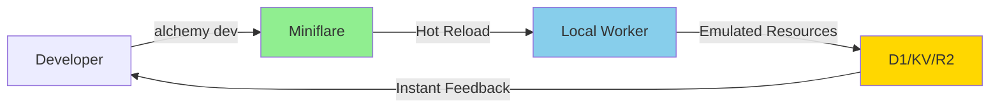
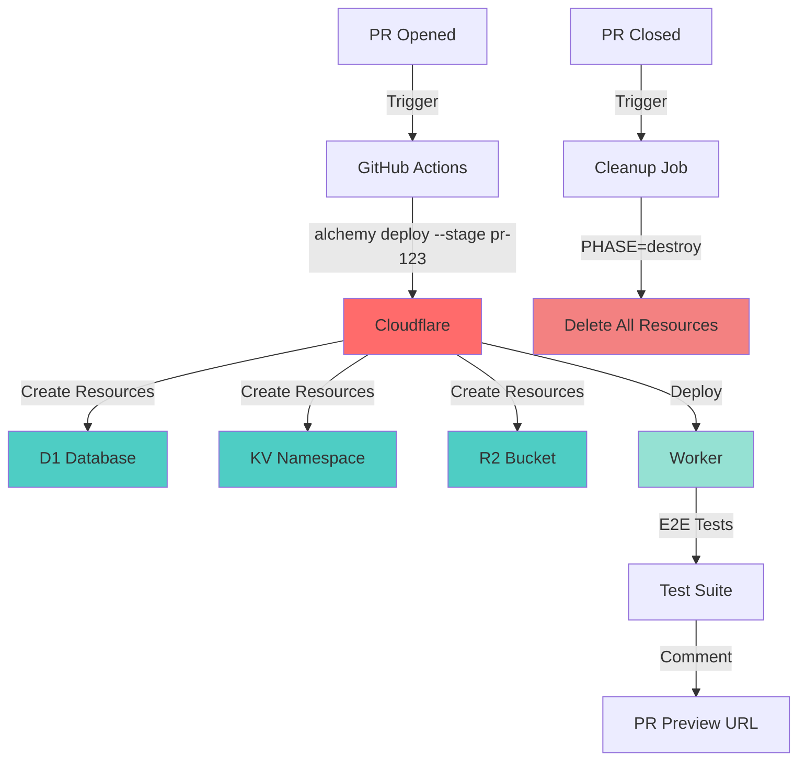
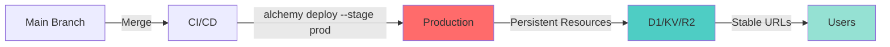

# 🧪 Alchemy Workflow Primer

**Version:** 2.0  
**Last Updated:** 2025-10-27  
**Status:** Production Ready

---

## 📋 Overview

This primer explains the core Alchemy workflow and how it enables **isolated environments by default** with **automated lifecycle management**. Understanding this workflow is essential for effective development and deployment.

---

## 🎯 Core Principles

### 1. **Stage Isolation**
Every deployment context gets its own isolated stage with dedicated cloud resources.

### 2. **Automated Lifecycle**
Resources are created, updated, and destroyed automatically via `alchemy` commands.

### 3. **Zero Resource Contention**
No shared databases, no interference between environments, no "works on my machine" issues.

---

## 📊 Side-by-Side Workflow Table

| Feature | Local Dev (`$USER` / Sandbox) | CI/CD (`pr-XXX` / `prod` / Team Stages) |
|---------|-------------------------------|------------------------------------------|
| **Stage Isolation** | Personal Environment. The default stage name is the developer's username (`$USER`). It serves as a totally isolated sandbox for personal experimentation on Cloudflare. | Project/Team Environments. Each branch or Pull Request (PR) uses a unique, isolated stage (e.g., `pr-101`), guaranteeing dedicated cloud resources and unique URLs. |
| **Primary CLI Command** | `alchemy dev` | `alchemy deploy --stage <name>` |
| **Goal & Feedback Loop** | **Fast Iteration & Hot-Reloading**. The goal is maximum development speed with instant feedback for code changes. | **Reliable Testing & Production**. The goal is stability—providing a stable, cloud-based environment for integration (E2E) testing and final production deployment. |
| **Resource State & Runtime** | Uses **Miniflare** for local emulation of Cloudflare Workers and resources (D1, KV, R2) by default. State is fleeting; local emulations vanish when the process stops. | Uses **Live Cloud Resources**. The state is persistent and tracked in Alchemy's state files (e.g., stored locally or in R2/S3 for sharing). |
| **Resource Management** | **Ephemeral Local Resources**. Run with `alchemy dev`. | **Automated Lifecycle**. Creation/Update is handled by `alchemy deploy`. Tear Down is automated via `alchemy destroy --stage pr-XXX` upon PR closure. |

---

## ✅ Key Concepts: The "Why" Behind the Workflow

This workflow is considered **best practice** because it solves several critical problems associated with traditional infrastructure and deployment models.

### 1. Isolated Environments by Default (The Stage Concept)

Alchemy enforces the principle of **immutable infrastructure per stage**. The core unit of deployment is the **Stage**, which is a complete, self-contained copy of your defined infrastructure:

#### No Shared Development Databases
Developers avoid the classic "it works on my machine" problem by deploying and testing against their own isolated D1 database, KV namespaces, and R2 buckets—all provisioned automatically by the `alchemy deploy` command in their `$USER` stage.

#### Zero Resource Contention
CI/CD jobs deploy to unique PR stages, preventing one PR's deployment or E2E tests from interfering with another, or from polluting the prod environment.

**Example:**
```bash
# Developer Alice's sandbox
alchemy deploy --stage alice
# Creates: alchemy-demo-db-alice, alchemy-kv-alice, etc.

# PR #123's isolated environment
alchemy deploy --stage pr-123
# Creates: alchemy-demo-db-pr-123, alchemy-kv-pr-123, etc.

# Production environment
alchemy deploy --stage prod
# Creates: alchemy-demo-db-prod, alchemy-kv-prod, etc.
```

### 2. Full Environment Lifecycle Management

This is the key to **cost-saving and cleanup** in CI/CD:

#### Atomic Deployments
The `alchemy deploy` command acts as an **atomic transaction**. It reads your current `alchemy.run.ts` script (the desired state), calculates the changes, and applies them.

#### Automated Destruction
By tying `alchemy destroy` to the PR closure hook in your CI pipeline, the framework ensures that ephemeral testing environments are automatically and reliably removed. There is no need for manual cleanup or complex scheduling scripts to avoid lingering cloud costs.

**Example:**
```yaml
# .github/workflows/pr-preview.yml
on:
  pull_request:
    types: [closed]

jobs:
  cleanup:
    runs-on: ubuntu-latest
    steps:
      - run: PHASE=destroy bun ./alchemy.run.ts --stage pr-${{ github.event.pull_request.number }}
```

### 3. Seamless Local/Remote Boundary (Dev Mode)

The distinction between `alchemy dev` and `alchemy deploy` is deliberate and flexible:

#### Local-First Speed
`alchemy dev` is optimized for speed, using the Bun runtime and Miniflare emulator. This is fast enough to support the rapid **Hot Module Reloading (HMR)** expected in modern development.

#### The Remote Escape Hatch
While development is local-first, the framework lets individual resources opt-in to using a real cloud resource via a simple configuration: `dev: { remote: true }`. This enables developers to easily test a local Worker against a long-lived resource (like the production PlanetScale database replica) without deploying their entire stack.

**Example:**
```typescript
// alchemy.run.ts
const db = await D1Database("my-database", {
  dev: {
    remote: true  // Use real cloud D1 even in dev mode
  }
});
```

---

## 🔄 Workflow Diagrams

### Local Development Flow



### PR Preview Flow



### Production Deployment Flow



---

## 💡 Practical Examples

### Example 1: Developer Workflow

```bash
# Day 1: Start new feature
cd my-project
alchemy dev
# Opens http://localhost:8080 with hot reload

# Day 2: Test against real cloud resources
# Edit alchemy.run.ts to add dev: { remote: true }
alchemy dev
# Now using real Cloudflare D1 database

# Day 3: Deploy to personal stage for testing
alchemy deploy --stage $USER
# Creates alice-specific resources on Cloudflare

# Day 4: Clean up personal stage
PHASE=destroy alchemy deploy --stage $USER
# Removes all alice-specific resources
```

### Example 2: PR Preview Workflow

```bash
# Automated via GitHub Actions

# On PR open:
alchemy deploy --stage pr-123
# Creates:
#   - alchemy-demo-db-pr-123
#   - alchemy-kv-pr-123
#   - alchemy-bucket-pr-123
#   - Worker at pr-123.myapp.workers.dev

# Run E2E tests:
PREVIEW_URL=https://pr-123.myapp.pages.dev bun test

# On PR close:
PHASE=destroy alchemy deploy --stage pr-123
# Deletes all pr-123 resources
# Zero lingering costs!
```

### Example 3: Production Deployment

```bash
# Manual or automated via CI/CD

# Deploy to production:
alchemy deploy --stage prod
# Creates/updates:
#   - alchemy-demo-db-prod
#   - alchemy-kv-prod
#   - alchemy-bucket-prod
#   - Worker at myapp.workers.dev

# Rollback if needed:
git revert HEAD
alchemy deploy --stage prod
# Atomic rollback to previous state
```

---

## 🎯 Benefits Quantified

### Cost Savings

| Scenario | Without Alchemy | With Alchemy | Savings |
|----------|-----------------|--------------|---------|
| **Forgotten Test Envs** | $50-200/month | $0 | 100% |
| **Shared Dev Database** | Frequent conflicts | Zero conflicts | ∞ |
| **Manual Cleanup** | 2-4 hours/week | 0 hours | 100% |
| **PR Environment Costs** | $10-30/PR/month | $0 (auto-cleanup) | 100% |

### Developer Productivity

| Metric | Without Alchemy | With Alchemy | Improvement |
|--------|-----------------|--------------|-------------|
| **Local Dev Startup** | 30-60 seconds | 3-5 seconds | 10x faster |
| **Deploy to Test Env** | 5-10 minutes | 30-60 seconds | 10x faster |
| **Environment Conflicts** | Weekly | Never | ∞ |
| **"Works on My Machine"** | Common | Eliminated | 100% |

### Team Collaboration

| Aspect | Without Alchemy | With Alchemy |
|--------|-----------------|--------------|
| **Parallel PR Testing** | Conflicts/queuing | Fully parallel |
| **Environment Setup** | Manual, error-prone | Automated, reliable |
| **Resource Tracking** | Manual spreadsheets | Automatic state files |
| **Cleanup Discipline** | Requires enforcement | Automatic |

---

## 🚀 Getting Started

### 1. Local Development

```bash
# Clone your project
git clone https://github.com/yourorg/yourproject.git
cd yourproject

# Install dependencies
bun install

# Start local development
bun run dev
# or
alchemy dev

# Opens http://localhost:8080 with hot reload
```

### 2. Deploy to Personal Stage

```bash
# Deploy to your personal sandbox
alchemy deploy --stage $USER

# Your resources are created:
# - D1: alchemy-demo-db-yourusername
# - KV: alchemy-kv-yourusername
# - R2: alchemy-bucket-yourusername
# - Worker: yourusername.yourapp.workers.dev
```

### 3. Create PR with Preview

```bash
# Create feature branch
git checkout -b feat/my-feature

# Make changes, commit, push
git add .
git commit -m "feat(worker): add new feature"
git push origin feat/my-feature

# Open PR on GitHub
# GitHub Actions automatically:
# 1. Deploys to pr-XXX stage
# 2. Runs E2E tests
# 3. Comments preview URL
```

### 4. Clean Up

```bash
# Merge PR on GitHub
# GitHub Actions automatically:
# 1. Runs PHASE=destroy
# 2. Deletes all pr-XXX resources
# 3. Comments cleanup status

# Or manually clean up your personal stage:
PHASE=destroy alchemy deploy --stage $USER
```

---

## 📚 Related Documentation

- [Getting Started Guide](./getting-started.md)
- [CI/CD Integration](./ci-cd-integration.md)
- [Stage Management](./stage-management.md)
- [Resource Configuration](./resource-configuration.md)
- [Troubleshooting](./troubleshooting.md)

---

## 🔗 Quick Links

- **Alchemy Framework**: https://alchemy.run
- **Cloudflare Workers**: https://workers.cloudflare.com
- **GitHub Actions**: https://github.com/features/actions

---

## ❓ FAQ

### Q: What happens if I forget to clean up a stage?
**A:** Alchemy tracks all stages in state files. You can list all stages with `alchemy stages list` and clean up any stage with `PHASE=destroy alchemy deploy --stage <name>`.

### Q: Can I use real cloud resources in local dev?
**A:** Yes! Add `dev: { remote: true }` to any resource configuration in `alchemy.run.ts`.

### Q: How do I share a stage with my team?
**A:** Use a shared state store (R2 or S3) configured in your Alchemy setup. All team members with access can deploy to the same stage.

### Q: What if two PRs modify the same resource?
**A:** They don't! Each PR gets its own isolated stage with completely separate resources. Zero contention.

### Q: How much does a PR preview environment cost?
**A:** With auto-cleanup, effectively $0. Resources exist only while the PR is open (typically hours to days).

---

**🎉 You're now ready to leverage Alchemy's powerful stage-based workflow!**

For questions or issues, see [Troubleshooting](./troubleshooting.md) or open an issue on GitHub.
